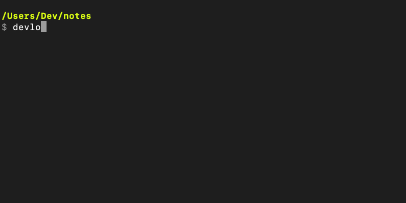

### Dev Log
[](https://circleci.com/gh/automoto/devlog)

*The command line first app to capture your notes, reflections, and TODOs in markdown.*

<!-- toc -->

* [What is Devlog?](#what-is-devlog)
* [What kind of note files can we generate?](#what-kind-of-note-files-can-we-generate)
* [What is a Development Log?](#what-is-a-development-log)
* [Install](#install)
  * [Install Using Go](#install-using-go)
* [Using Devlog](#using-devlog)
  * [Configure](#configure)
  * [Configuration using command line options:](#configuration-using-command-line-options)
  * [Configuration using environment variables:](#configuration-using-environment-variables)
* [Customizing content of Devlog files](#customizing-content-of-devlog-files)
* [Contributing](#contributing)

<!-- tocstop -->

#### What is Devlog?

Devlog generates a simple note, todo or "Development Log" journal markdown document that is customizable. You can save your devlog files into a git repository or to a local directory that will sync with dropbox, google drive, or one drive for automated syncing and backup.



Devlog prioritizes:
- Open standards over closed. Keep your notes in markdown files that can be searched for easily in a directory, not locked into some vendors service or custom formatting standards.
- Simplicity. This is not meant to be a complex static content generator. It strives to be an easy to configure and create customizable markdown files that you can fill out in a text editor of your choice.
- Commandline first. You should be able to create, edit, and, view notes without leaving your commandline and having to context switch.
- Ease of use. Sensible defaults for most things and simple options for customization as well.

#### What kind of note files can we generate?

Currently there are three kind of documents you can create:
- **note:** Generates an empty note markdown document with a title. Great for quickly jotting down some notes or any content you want to add that is less structured.
- **todo:** Generates a TODO markdown file with a few checkboxes.
- **log:** Generates a "Development Log" which is a document with questions you fill out at the end of a development session to reflect on how the session went and what you learned.

All documents are generated with a timestamp and can be customized via a template if you desire.

#### What is a Development Log?

A development log is a like a software development journal that you fill out after a coding session. It's great for reflecting on how coding sessions went, doing brain dumps and or quickly documenting TODOs.

Filling out these type of "development logs" and notes about coding sessions is inspired by the [note taking practices of prolific Doom/VR developer John Carmack](https://news.ycombinator.com/item?id=12575501). This can also be useful when paired with a "shutdown routine" at the end of an intense work session to help us mentally disconnect. More about "shutdown routines": [[1]](https://www.calnewport.com/blog/2009/06/08/drastically-reduce-stress-with-a-work-shutdown-ritual/)[[2]](https://www.calnewport.com/blog/2012/08/02/work-less-to-work-better-my-experiments-with-shutdown-routines/).

#### Install
The easiest way to install devlog is to use the provided installation script
```shell
wget https://raw.githubusercontent.com/automoto/devlog/master/scripts/get-devlog.sh
# you're welcome to examine the script, it just grabs the latest release from github for your OS and installs it
sh get-devlog.sh
```

If you prefer to install it yourself, you can get the latest release binary directly from github https://github.com/automoto/devlog/releases and extract it to your `/usr/local/bin`.

##### Install Using Go

If you already have an updated version of go lang, installing via go is easy:
`go get -u github.com/automoto/devlog/`


#### Using Devlog

Devlog is designed to automate generating a markdown file for you to fill out in your favorite text editor. Once you have installed it, just type `devlog` and it will generate a time stamped markdown document.

Generate a document:
```shell
# Generate a 'note' markdown document in the current directory. Note is the default kind of document.
devlog

# Generate a 'development log' markdown document with the -type or -t option
devlog -type log

# Generate a 'todo' markdown document using the -t shorthand option
devlog -t todo
```

Specify the path where a document is generated:
```shell
# Specify the path of where the output file will be saved with the -path or -p option
devlog -path '/home/documents'

# You can also output a document to your terminal instead of a file
devlog -path 'stdout'
```

Customize the layout of a generated document:
```shell
# Use a custom template to generate a todo document
devlog -template 'custom_todo.gohtml' -type todo

```

Adding tags to a generated document. Tags will appear at the top of a document and will be prefixed with a `#`:
``` shell
# Create a new document with a single tag
devlog -tag 'python'

# Create a document with multiple tags
devlog -tag 'python, sql'
```

By default, it returns the path of the document created so you can input this into a text editor easily. Here is a way you can generate a markdown document and open it in some popular text editors:

```shell

# create a new Devlog file and open it in SublimeText
subl `devlog | tail -n 1`

# create a new Devlog file and open it in vim
vim `devlog | tail -n 1`

# create a new Devlog file and open it in nano
nano `devlog | tail -n 1`
```

##### Configure
By default `devlog` will generate a markdown file in the current directory unless you specify the directory via setting environment variables or through command line options you set.

##### Configuration using command line options:

You can also pass in configurations via command line options. Command line options take precedence over configurations set via environment variables.
```shell
# Save a file to a specific directory and using a custom template
devlog -p "/home/your_username/your_directory" -template "/home/your_username/your_directory/custom.gohtml"

# Generate a 'todo' markdown document with the -type or -t option
devlog -t todo
```

##### Configuration using environment variables:

Set the directory to save devlog files to:
```shell
export DEVLOG_DIR="/home/your_username/your_directory"
```

Set the default template for your devlog files content:
```shell
export DEVLOG_NOTE_TEMPLATE="/home/your_custom_note.gohtml"

export DEVLOG_TODO_TEMPLATE="/home/your_custom_todo.gohtml"

export DEVLOG_LOG_TEMPLATE="/home/your_custom_log.gohtml"
```

You can override this by temporarily setting the value when calling devlog

```shell
DEVLOG_DIR="/home/your_username/other_directory" devlog
```

To view all the possible command line options, just pass in the `-h` command line option for help e.g. `devlog -h` 

#### Customizing content of Devlog files
You can customize the content of your markdown document by creating a `.gohtml` file and specifying your custom content there.
```gohtml
### Development Log
*created: {{.FormattedCurrentTime}}*
*tags: {{.Tags}}

##### Notes

**TODO**

- [ ]
- [ ]
```
*note you should include `{{.FormattedCurrentTime}}` in your template to include the date/time and `{{.Tags}}` to include tags.*

Now you can pass in your configuration file to devlog:
```
devlog -template your_custom_file.gohtml
```

#### Viewing the generated files
You can use any text editor or tool that can render markdown files if you like. If you prefer to keep your focus in the command line terminal,
 you can use a command line markdown viewer like [mdless](https://github.com/ttscoff/mdless), [mdr](https://github.com/MichaelMure/mdr/) or [glow](https://github.com/charmbracelet/glow).

#### Contributing
Take a look at our [Contributing](CONTRIBUTING.md) guide for instructions on how to build, test and submit changes to devlog.
